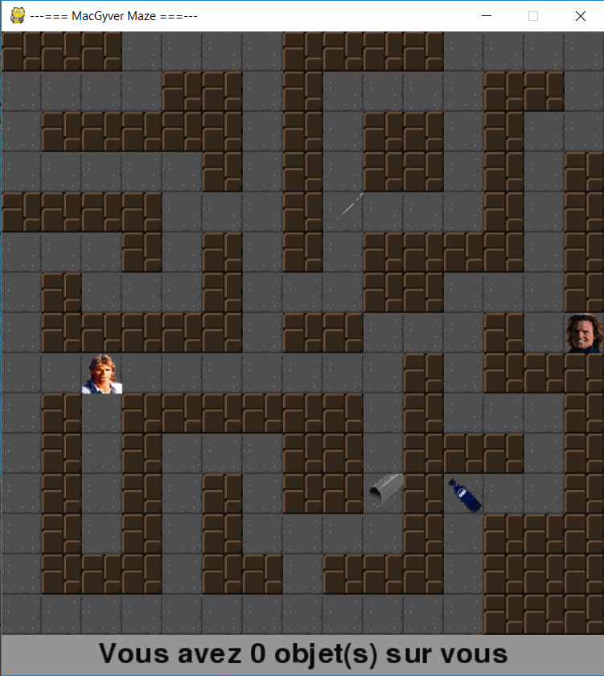

# Project 3
> Aidez MacGyver à s'échapper !

Étant un grand fan de Richard Dean Anderson, vous imaginez un labyrinthe 2D dans lequel MacGyver aurait été enfermé. La sortie est surveillée par un garde du corps dont la coiffure ferait pâlir Tina Turner.
Pour le distraire, il vous faut réunir les éléments suivants (dispersés dans le labyrinthe): une aiguille, un petit tube en plastique et de l'éther.
Ils permettront à MacGyver de créer une seringue et d'endormir notre garde.

Le jeu se joue avec les touches directionnelles.
Si vous touchez le gardien avec moins d'un objet à la main vous mourrez
Si vous touchez le gardien sans objet, il ne vous tuera pas

## Installation

Téléchargez le jeu à partir de Github puis installez les dépendances à partir
du fichier "requirements":

_For more examples and usage, please refer to the [Wiki][wiki]._

## Changelog

### Version 0.1:

  * Pas de graphique, le terrain se dessine dans l'invité de commande, les
    les positions des objets et celui du héros
  * Main.py fonctionne et le héros se déplace
  * L'environnement se charge et les 3 objets sont positionnés aléatoirement
  * Arrêt du jeu après 10 appuies sur une touche ou la touche "1"

### Version 0.2:

  1. Ajout de la fonction de récupération des objets
  2. Ajout de la fonction qui détermine si le héros rencontre un mur
  3. Nettoyage du code dans Environment.py
  4. Recodage de main.py afin de faire fonctionner les 2 modules ensemble

### Version 0.3:

  1. Ajout du graphique en standalone
  2. Ajout des fonctions qui dessine l'arrière plan, les murs, le héros, les outils
  3. Ajout de la fonction déplacement du héros en graphique (standalone)

### Version 0.4:

  1. Le jeu fonction en mode graphique

### Version 0.5:

  1. Définition de la position initiale du héros depuis le dessin du labyrinthe
  2. Dessin du gardien dans le jeu graphique
  3. Vérification du standard PEP8 sur tout les fichiers
  4. Ajout de la condition pour gagner le jeu

### Version 0.6:

  1. Le labyrinthe est chargé depuis un fichier texte
  2. Pour chaque objet, il lui est attribué une image dédiée

### Version 0.7:

  1. Le jeu démarre à partir de main.py uniquement

### Version 1.0:

  1. Le jeu peux démarrer soit en mode graphique soit (en mode commande (désactivé))
  2. Ajout d'un écran de fin

### Version 1.1:

  1. Ajout d'un écran de perdu
  2. Amélioration du code
  3. Ajout d'une possibilité de perdre
  4. Ajout d'un compteur d'objet

## To-Do List

  - [x] Rajouter un écran de fin.
  - [ ] Rajouter du son.
  - [ ] Trouver de meilleurs images.
  - [ ] Rajouter un écran de configuration
  - [ ] Rajouter la possibilité de choisir le labyrinthe
  - [ ] Une version développement disponible à partir d'un argument dans le Shell

<!-- Markdown link & img dfn's -->

[wiki]: https://i.skyrock.net/2059/12582059/pics/311796304_small.jpg
